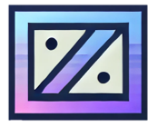

# Portafolio de MaKuaZ



## Descripción

Este proyecto es un portafolio digital personal desarrollado con Vue.js que muestra mis habilidades, proyectos y experiencia como desarrollador web y diseñador UX. El sitio enfatiza la accesibilidad web y ofrece diversas experiencias interactivas para los visitantes.

## Características Principales

- **Diseño Responsivo**: Compatible con dispositivos móviles y de escritorio
- **Múltiples Secciones**: Presentación, Acerca de, Playground, Educación y Comunicaciones
- **Opciones de Accesibilidad**: 
  - Modo de descanso visual
  - Modo daltónico (escala de grises)
  - Modo nocturno
  - Ajustes de tamaño de texto
- **Descarga de CV**: Permite a los visitantes descargar mi currículum en PDF
- **Enlaces a Redes Sociales**: Conexión directa a mis perfiles profesionales
- **Proyectos Interactivos**: Demos de proyectos personales en el Playground

## Tecnologías Utilizadas

- **Frontend**: Vue.js 3, Vuex, Vue Router
- **Estilos**: CSS3, Bootstrap 4
- **Iconos**: Font Awesome 5
- **Fuentes**: Google Fonts (Poppins, Lobster)

## Instalación y Configuración

### Requisitos Previos

- Node.js 14.x o superior
- npm 6.x o superior

### Pasos de Instalación

1. Clonar el repositorio:

```bash
git clone https://github.com/margandona/vue-portfolio.git
cd vue-portfolio
```

2. Instalar dependencias:

```bash
npm install
```

3. Iniciar servidor de desarrollo:

```bash
npm run serve
```

4. Construir para producción:

```bash
npm run build
```

## Estructura del Proyecto

```
vue-portfolio
├── public
│   ├── favicon.ico          # Favicon for the application
│   ├── index.html           # Main HTML file for the Vue application
│   └── manifest.json        # Metadata for the application
├── src
│   ├── assets
│   │   ├── css
│   │   │   └── style.css    # Custom styles for the application
│   │   ├── documents
│   │   │   └── curriculum.pdf # PDF document for the curriculum
│   │   ├── img
│   │   │   ├── icon
│   │   │   │   └── favicon-icons.png # Image used for favicons
│   │   │   ├── logo.png     # Logo image for the portfolio
│   │   │   └── img2.jpg     # Image used in the presentation section
│   ├── components
│   │   ├── Header.vue       # Header component
│   │   ├── Navbar.vue       # Navigation bar component
│   │   ├── Presentation.vue  # Main presentation component
│   │   ├── ScrollToTop.vue  # Scroll to top functionality
│   │   ├── modals
│   │   │   └── EducationModal.vue # Modal for educational reflections
│   │   └── sections
│   │       ├── AboutSection.vue # About section component
│   │       ├── AccessibilitySection.vue # Accessibility section component
│   │       ├── CommunicationsSection.vue # Communications section component
│   │       ├── EducationSection.vue # Education section component
│   │       └── PlaygroundSection.vue # Playground section component
│   ├── router
│   │   └── index.js         # Vue Router setup
│   ├── store
│   │   ├── index.js         # Vuex store initialization
│   │   └── modules
│   │       └── accessibility.js # Accessibility state management
│   ├── utils
│   │   └── accessibility.js  # Utility functions for accessibility
│   ├── views
│   │   └── HomeView.vue     # Home view component
│   ├── App.vue              # Root component
│   └── main.js              # Entry point for the Vue application
├── .browserslistrc          # Target browsers for the application
├── .eslintrc.js             # ESLint configuration
├── .gitignore               # Git ignore file
├── babel.config.js          # Babel configuration
├── package.json             # Project metadata and dependencies
├── README.md                # Project documentation
└── vue.config.js            # Vue CLI configuration
```

## License

This project is licensed under the MIT License.