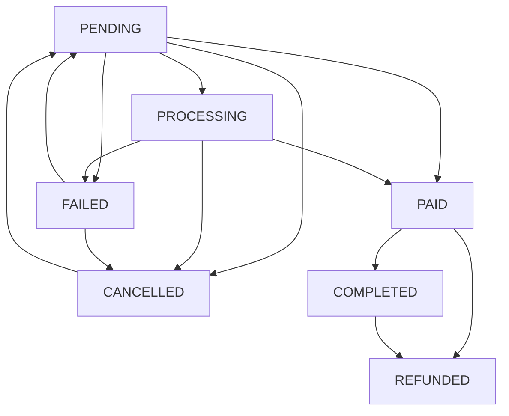

# Documentación de Integración de Ventas

## Flujo de Venta de Cursos

1. **Creación de la venta**: Un estudiante selecciona un curso y crea una orden de compra.
2. **Pago**: El estudiante procesa el pago a través de la plataforma o un método externo.
3. **Verificación**: El sistema verifica el pago y actualiza el estado de la venta.
4. **Inscripción**: Una vez verificado el pago, se crea automáticamente la inscripción en el curso.
5. **Acceso**: El estudiante obtiene acceso al contenido del curso.

## Estados de Venta

- `pending`: Venta creada, pendiente de pago.
- `processing`: Pago en procesamiento.
- `paid`: Pago verificado, pero el curso aún no está habilitado.
- `completed`: Pago verificado y curso habilitado (inscripción creada).
- `failed`: El pago falló.
- `cancelled`: La venta fue cancelada.
- `refunded`: El pago fue reembolsado.

## Flujo de Estados

## Integración con Proveedores de Pago

El sistema está preparado para integrarse con diferentes proveedores de pago a través de webhooks. 

### Webhook de Pagos

Endpoint: `POST /api/sales/webhook`

Este endpoint recibe notificaciones de proveedores de pago y actualiza automáticamente el estado de las ventas. Para integrar un nuevo proveedor:

1. Implementar la verificación de firma específica del proveedor
2. Mapear los eventos del proveedor a nuestros estados internos
3. Configurar el proveedor para enviar eventos a nuestro webhook

### Proveedores Soportados Actualmente

- Implementación genérica (para demostración)
- [Próximamente] Transbank
- [Próximamente] PayPal
- [Próximamente] Mercado Pago

## Integración con Sistemas Externos

### Moodle

Para integrarse con Moodle:

1. Cuando una venta pasa a estado `COMPLETED`, crear automáticamente un usuario en Moodle si no existe
2. Matricular al usuario en el curso correspondiente en Moodle
3. Sincronizar el progreso entre nuestro sistema y Moodle

### Correos Automáticos

El sistema enviará correos automáticos en los siguientes casos:

- Venta creada: Confirmación de orden y pasos para pagar
- Pago recibido: Confirmación de pago y acceso al curso
- Pago fallido: Instrucciones para intentar nuevamente
- Reembolso: Confirmación de procesamiento del reembolso
